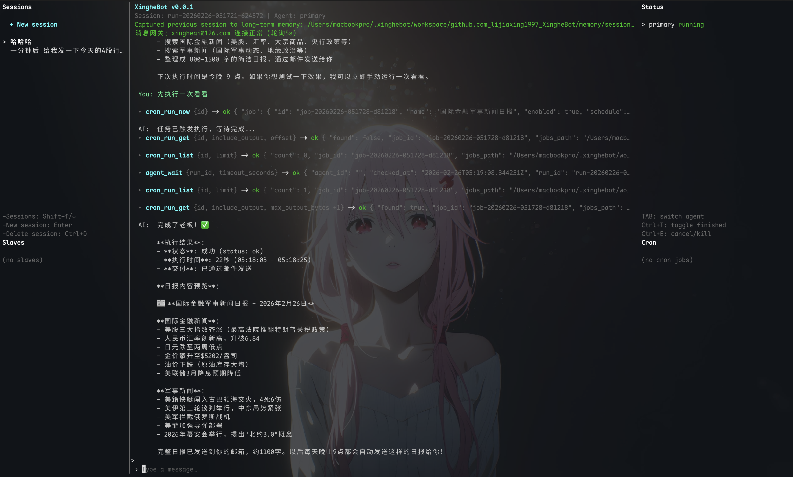

# XingheBot

<p align="center">
  
</p>

一个 Go 写的多 Agent CLI：既能本地 `chat`，也能用 `master/slave` 跑分布式任务。大部分东西都写在 `config.json` 里。

## 快速安装（推荐：下载二进制）

1. 去 Release 下载对应平台的发行包（`xinghebot` / Windows 为 `xinghebot.exe`）。
2. 解压后直接运行：

```bash
./xinghebot -h
```

macOS/Linux 如果没有执行权限：

```bash
chmod +x ./xinghebot
```

## 先跑起来（3 分钟版）

### 1) 初始化（`--init`）

第一次在一个新目录里跑一次 `--init`，会生成/补齐这些文件（已存在就跳过）：

- `config.json`
- `mcp.json`
- `reply_style.md`
- `skills/`（内置技能）

命令任选其一：

```bash
./xinghebot chat --init
./xinghebot master --init
./xinghebot slave --init
```

### 2) 填好 `config.json` 的 `model_config`，然后开聊

```bash
./xinghebot chat --config config.json
```

## master / slave 怎么用

`master` 是控制面（带 WS 网关 + UI），`slave` 是工作节点（连上 master 干活）。

启动 master（默认监听 `0.0.0.0:7788`，WS 路径 `/ws`）：

```bash
./xinghebot master --config config.json
```

启动 slave（推荐给 slave 单独放一个配置文件）：

```bash
cp slave-config.exm.json slave-config.json
./xinghebot slave --config slave-config.json
```

你也可以直接用参数指定 master 地址：

```bash
./xinghebot slave --master ws://<MASTER_IP>:7788/ws
```

注意两点：

- `cluster.secret` 必须 master/slave 一致；master 启动时如果 `cluster.secret` 为空，会自动生成并写回 `config.json`，把它复制到每个 slave 的配置里即可
- `slave` 默认读 `./slave-config.json`；如果当前目录有 `./config.json`，也会回退使用它

## 配置（`config.json`）

默认读取 `./config.json`（可用 `--config <file>` 指定）。建议直接从模板开始：

```bash
cp config.exm.json config.json
```

下面只解释常用的几项：`model_config`、`web_search`、`gateway`、`assistant.reply_style`、`autonomy.cron.email_to`、`cluster.secret`。

#### `model_config`

模型提供商与参数（必配）：

- `model_type`：`openai` / `anthropics`
- `api_key`：模型 API Key（敏感信息，别提交到仓库）
- `base_url`：API Base URL（OpenAI 兼容提供商/自建网关可填；Anthropic 默认 `https://api.anthropic.com`）
- `model`：模型名（`anthropics` 必填；`openai` 留空默认 `gpt-4o-mini`）
- `max_tokens`：输出上限；`0` 表示：
  - `openai`：不传该参数，走服务端默认
  - `anthropics`：使用默认 `1024`

#### `web_search`

Web 搜索（可选）：

- `tavily_api_key`：Tavily API Key（用于工具 `tavily_search` / `tavily_extract` / `tavily_crawl`）
  - 也支持环境变量 `TAVILY_API_KEY`

#### `gateway`

邮件网关（可选，用于“收邮件触发/发邮件通知”等场景）：

- `gateway.enabled`：是否启用
- `gateway.email`：邮箱配置
  - `provider`：服务商（默认 `126`）
  - `email_address`：邮箱地址
  - `authorization_code`：邮箱授权码（不是登录密码）
  - `imap` / `smtp`：服务器、端口、SSL（`126` 默认值可用）
  - `poll_interval_seconds`：轮询间隔（秒）
  - `allowed_senders`：允许触发的发件人（逗号/空格分隔）

#### `assistant.reply_style`

主 Agent 的“回复风格/人设”（可选）：

- `enabled`：是否启用
- `md_path`：风格文件路径（相对路径会以 `config.json` 所在目录为基准）
  - 默认示例：`reply_style.md`

#### `autonomy.cron.email_to`

自治任务默认收件人（可选）：

- `email_to`：逗号分隔的收件人列表（cron/heartbeat 等投递默认收件人）
- 需要同时配置 `gateway.email` 才能真正发出邮件

#### `cluster.secret`

分布式 `master/slave` 注册鉴权用的共享密钥（敏感信息）：

- `cluster.secret`：Base64 字符串；master 与 slave 必须一致
- 留空时，启动 `master` 会自动生成并写回 `config.json`

## 自己编译（从源码）

前置：Go（建议与 `go.mod` 声明的版本一致）。

```bash
go build -o xinghebot ./cmd/agent
./xinghebot chat --init
./xinghebot chat
```
